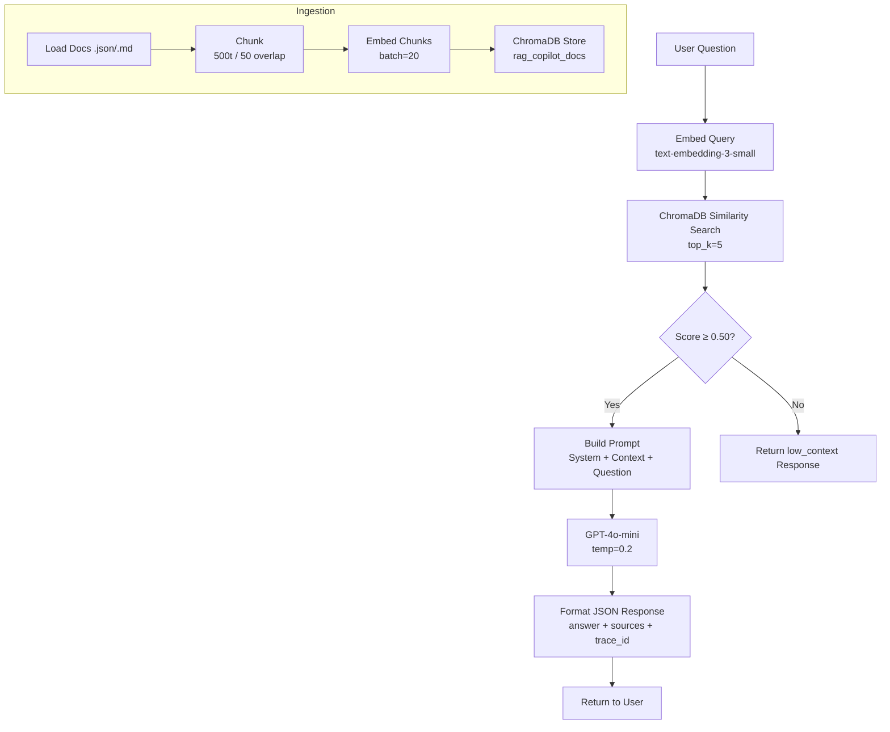

# RAG Copilot — Pipeline Deep Dive

## Pipeline Overview

The RAG pipeline has two phases:

1. **Ingestion Phase** (one-time or triggered via `/rag/ingest`)
2. **Query Phase** (every `/rag/ask` call)

---

## Phase 1: Ingestion

```
backend/data/docs/
  ├── doc_001_getting_started.json
  ├── doc_002_billing_faq.md
  ├── ...
  └── doc_042_api_rate_limits.json
         │
         ▼
  [1] LOAD documents
      → Read all .json and .md files
      → Extract: title, content, doc_id, tags
         │
         ▼
  [2] CHUNK documents
      → RecursiveCharacterTextSplitter
      → chunk_size = 500 tokens
      → chunk_overlap = 50 tokens
      → Assigns chunk_id = "{doc_id}_chunk_{n}"
         │
         ▼
  [3] EMBED chunks
      → OpenAI text-embedding-3-small
      → 1536-dimensional float vector per chunk
      → Batched (20 chunks per API call)
         │
         ▼
  [4] STORE in ChromaDB
      → Collection: rag_copilot_docs
      → Stored: vector + metadata (doc_id, title, chunk_id, chunk_text)
      → Persistent on disk: backend/.chroma/
```

### Ingestion Config

```python
CHUNK_SIZE = 500          # tokens
CHUNK_OVERLAP = 50        # tokens
EMBEDDING_MODEL = "text-embedding-3-small"
EMBEDDING_BATCH_SIZE = 20
CHROMA_COLLECTION = "rag_copilot_docs"
CHROMA_PERSIST_DIR = "./backend/.chroma"
```

---

## Phase 2: Query (per /rag/ask call)

```
User Question: "How do I reset my API key?"
         │
         ▼
  [5] EMBED query
      → Same model: text-embedding-3-small
      → Produces 1536-dim query vector
         │
         ▼
  [6] RETRIEVE top-k chunks
      → ChromaDB cosine similarity search
      → top_k = 5 (default, configurable)
      → Returns: chunk_text, score, metadata
      → Filter: score > LOW_CONTEXT_THRESHOLD (0.5)
         │
         ▼
  [7] BUILD PROMPT
      → System prompt: instructs LLM to answer ONLY from context
      → Context block: top-k chunk texts joined
      → Human message: user's question
         │
         ▼
  [8] LLM GENERATION
      → Model: gpt-4o-mini
      → temperature = 0.2 (factual, low creativity)
      → max_tokens = 1024
      → If no chunks pass threshold → status = "low_context"
         │
         ▼
  [9] FORMAT RESPONSE
      → Pydantic model → JSON
      → Attach sources list with scores
      → Generate trace_id (UUID)
      → Record latency_ms
```

### Query Config

```python
TOP_K = 5
LOW_CONTEXT_THRESHOLD = 0.50   # min cosine score to use a chunk
LLM_MODEL = "gpt-4o-mini"
LLM_TEMPERATURE = 0.2
LLM_MAX_TOKENS = 1024
```

---

## System Prompt Template

```
You are a helpful assistant for CloudDesk, a SaaS product.
Answer the user's question using ONLY the context provided below.
If the context does not contain enough information to answer confidently,
say so clearly — do NOT make up information.

Context:
{context}

Answer the question concisely and cite which part of the context you used.
```

---

## Low Context Logic

```python
if max(scores) < LOW_CONTEXT_THRESHOLD:
    return AskResponse(
        answer="I don't have enough relevant information...",
        sources=[],
        status="low_context",
        ...
    )
```

---

## Data Flow Diagram (Mermaid)


